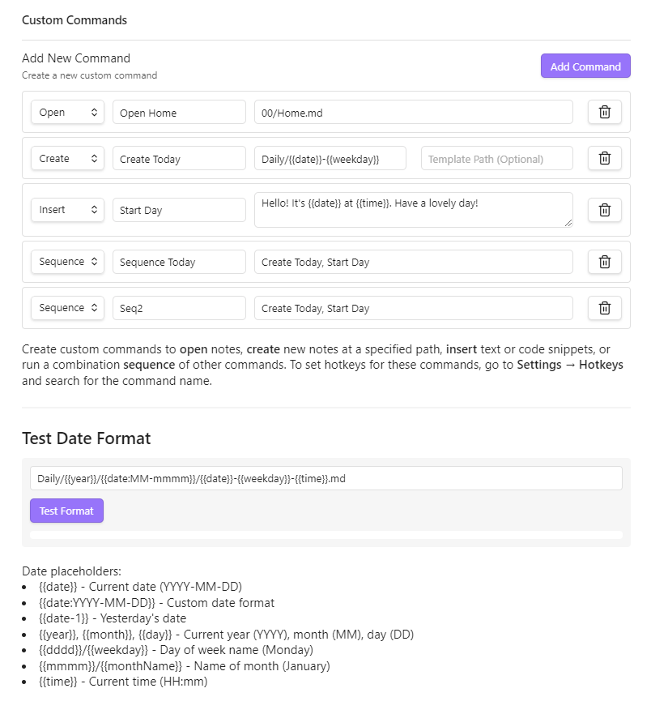

# Custom Commands for Obsidian

Create personalized commands in Obsidian to streamline your workflow. Define commands that can open specific notes, create new notes with optional templates, insert text snippets, or run sequences of other commands.

## Features

- **Open Commands**: Navigate directly to specific notes using dynamic date formatting
- **Create Commands**: Generate new notes at specific paths with optional templates
- **Insert Commands**: Insert text snippets with dynamic date/time placeholders
- **Sequence Commands**: Chain multiple commands together to execute in sequence
- **Date & Time Placeholders**: Use dynamic date/time formatting in all commands
- **New Tab Control**: Choose whether commands open notes in current tab, new tab, or new window

## Installation

### From Obsidian Community Plugins

1. Open Settings in Obsidian
2. Navigate to Community plugins and turn off Restricted Mode
3. Click Browse and search for "Custom Commands"
4. Install the plugin and enable it

### Manual Installation

1. Download the latest release from the [GitHub releases page](https://github.com/Staaaaaaaaaan/obsidian-custom-commands/releases)
2. Extract the files into your `.obsidian/plugins/custom-commands/` folder
3. Reload Obsidian and enable the plugin in Settings > Community plugins

## Usage

### Creating a Command

1. Go to Settings > Custom Commands
2. Click "Add Command"
3. Choose a command type (Open, Create, Insert, or Sequence)
4. Give your command a name
5. Fill in the required fields based on the command type
6. Your command will appear in the Command Palette (Ctrl/Cmd+P)

### Command Types

#### Open Command
Opens an existing note at the specified path.
- **Path**: The path to the note (e.g., `Journal/{{date}}.md`)

#### Create Command
Creates a new note at the specified path, optionally using a template.
- **Path**: Where to create the new note (e.g., `Meetings/{{date}}-Meeting.md`)
- **Template Path**: Optional path to a template file to use as content

#### Insert Command
Inserts a snippet of text at the current cursor position.
- **Snippet**: The text to insert, which can include date/time placeholders

#### Sequence Command
Runs multiple commands in sequence.
- **Command Names**: Comma-separated list of command names to execute in order

### Date & Time Placeholders

Use these dynamic placeholders in paths, templates, and snippets:

- `{{date}}` - Current date (YYYY-MM-DD)
- `{{date:YYYY-MM-DD}}` - Custom date format
- `{{date+1}}` - Tomorrow's date
- `{{date-1}}` - Yesterday's date
- `{{year}}`, `{{month}}`, `{{day}}` - Current year, month, day
- `{{weekday}}` - Day name (Monday, Tuesday, etc.)
- `{{monthName}}` - Month name (January, February, etc.)
- `{{time}}` - Current time (HH:mm)
- `{{time:HH:mm:ss}}` - Custom time format

### Adding Hotkeys

1. Go to Settings > Hotkeys
2. Search for your custom command by name
3. Click the plus icon to add a hotkey

## Examples

### Daily Journal
- **Type**: Create
- **Name**: Open Today's Journal
- **Path**: `Journal/{{year}}/{{date}}-{{weekday}}.md`
- **Template**: `Templates/Journal.md`

### Meeting Notes
- **Type**: Create
- **Name**: New Meeting
- **Path**: `Meetings/{{date}}-Meeting.md`
- **Template**: `Templates/Meeting.md`

### Insert Timestamp
- **Type**: Insert
- **Name**: Add Timestamp
- **Snippet**: `[{{time}}] `

### Morning Routine
- **Type**: Sequence
- **Name**: Morning Setup
- **Command Names**: `Open Today's Journal, Add Timestamp, Daily Note: Open today's daily note`

## Compatibility

- Requires Obsidian v0.15.0 or above
- Works on desktop and mobile

## License

This project is licensed under the MIT License - see the [LICENSE](LICENSE) file for details.

## Support

- [GitHub Issues](https://github.com/Staaaaaaaaaan/obsidian-custom-commands/issues)
- [Obsidian Forum](https://forum.obsidian.md)
